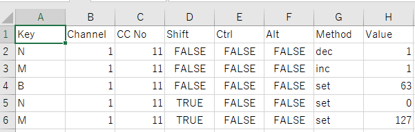
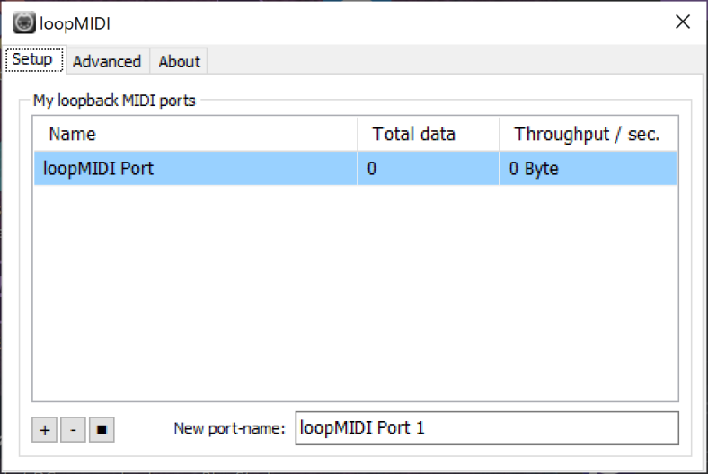
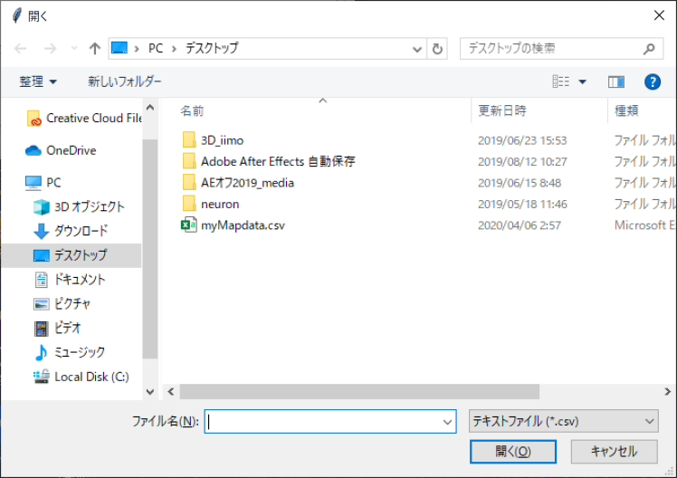
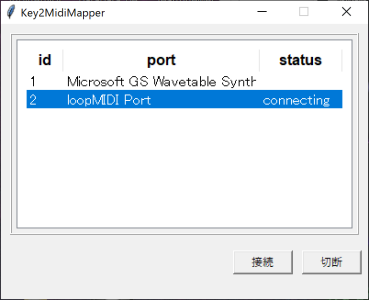

# KeyMidiMapper

キーボードからの入力をMIDI信号にマッピングして出力します。
左手デバイス[Orbital2](https://brainmagic.tokyo/privacy/)の入力をVJソフト[Resolume](https://resolume.com/)で利用するために作ったものです。

# 事前準備

事前準備として、MIDIのバーチャルルーティングソフト必要となります。
windowsの環境の方は、Tobias Erichsen氏が公開しているloopMIDIがなどお使いください。

[Tobias Erichsen氏のサイト](http://www.tobias-erichsen.de/)

また、キーボード操作とMIDI操作のマッピングデータをcsvファイルで作成します。これは[myMapdata.csv](myMapdata.csv)をテンプレートにして作成するのがおすすめです。

## マッピングデータのcsv各欄の入力内容について

- Key 
    動作対象となる任意のキーをアルファベットで指定します。

- Channel、CC 
    動作対象となるMIDIのChannelとCntrolChangeの番号を指定します。

- Shift、Ctrl、Alt 
    KeyのキーとShift、Ctrl、Altを同時に入力した場合の
    の欄に"True"を指定します。 
    同時入力させたくない場合はが"Flase"を指定します

- Method、Value 
    キー入力に対し、以下三つの動作方法を指定できます。

    - inc 
        Valueの値に比例して指定のControlChangeの値を増加します。

    - dec 
        Valueの値に比例して指定のControlChangeの値を減少します。

    - set 
        指定のControlChangeにValueの値をセットします。
 
 

# 使い方

MIDIのバーチャルルーティングソフトを起動し、適当なポートを作成します。（画像はloopMIDIでの動作例）

続いて、実行ファイル（Windowsのみ）かpython経由でKeyMidiMapper.pyを起動します。
マッピングデータ読み込みのダイアログが表示されますので、作成したcsvファイルを指定してください。

バーチャルルーティングソフトで作成したポート名を選択し、
connectingと表示されたらOKです。

あとはResoliumeなどのMIDI入力対応ソフトを立ち上げ、動作を確認してください。

# 備考

連続してキー入力が行われた場合、前のキー入力との時間間隔に応じてCCの値に追加される数値の係数が増減します。入力時間に対してパラメータの増減が非線形になるよう感度調整がされてます。（短い間隔で同じキー入力が連続すると大きい数値で増減する） 
これはOrbital2のダイヤル操作は指定したキーが連続して入力する仕様に対応するためです。この処理は`calc_interval`関数で定義されています。

